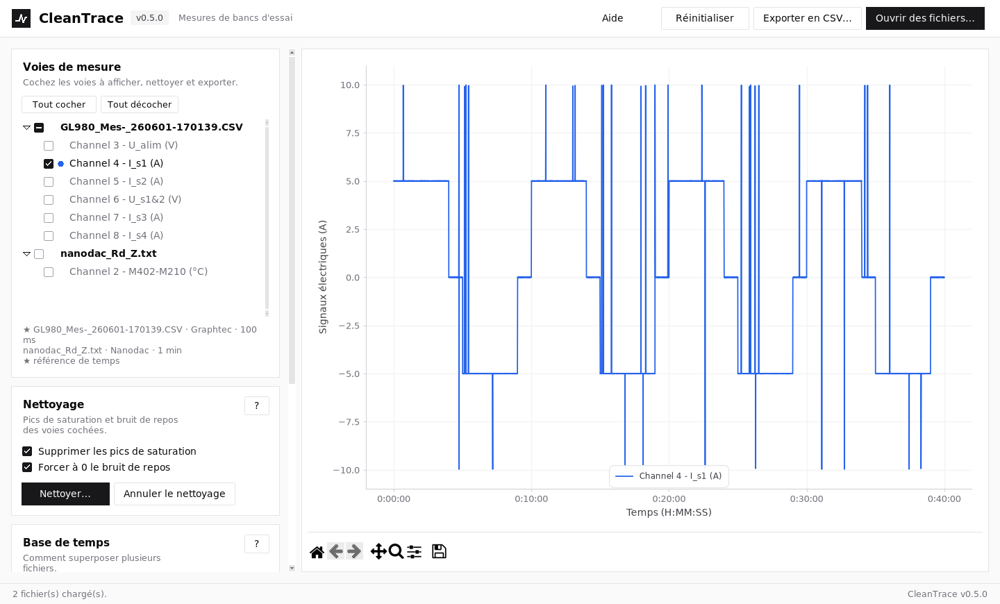
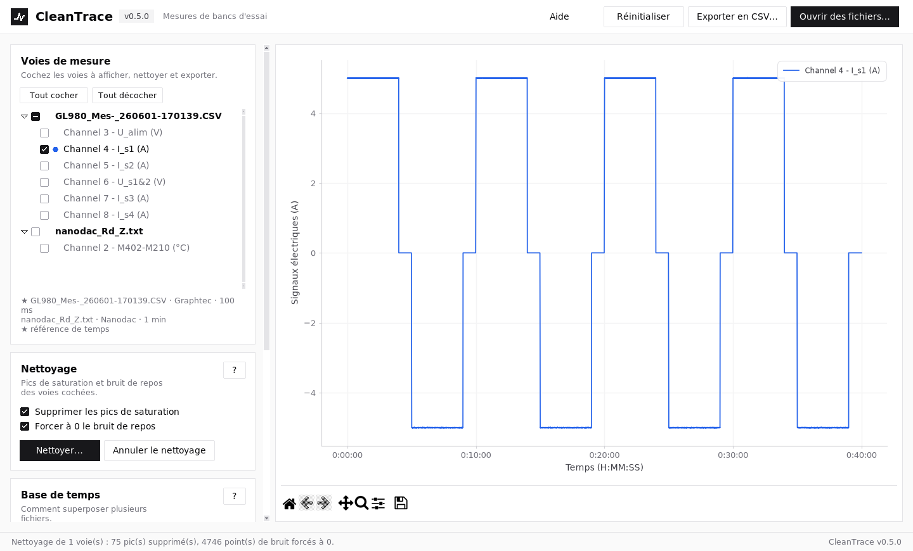
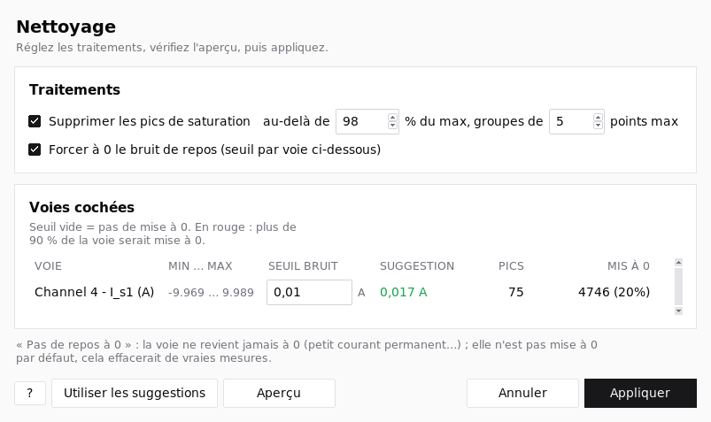
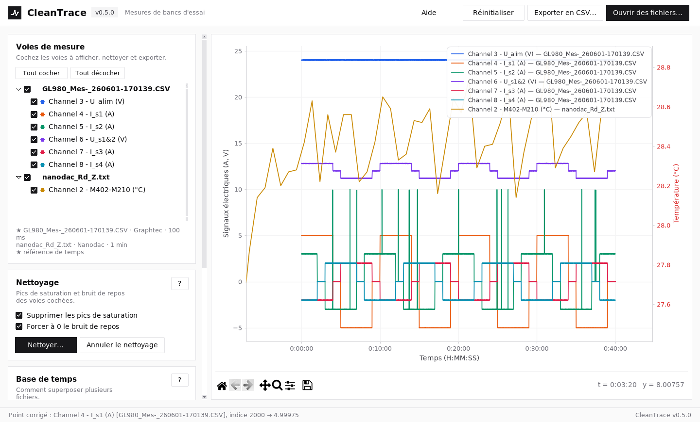

# CleanTrace

Nettoyer les mesures de bancs d'essai **sans déformer le signal**.

Importe les fichiers de plusieurs centrales (Graphtec, Nanodac, Graphset, enceinte
climatique…), les recale sur un même axe temps, supprime le bruit et les pics de
saturation, puis exporte un CSV propre.


*Avant : pics de saturation parasites à ±10 A.*


*Après « Nettoyer » : les créneaux restent intacts et le repos est à 0.*

---

## Lancer l'application

### Avec Spyder (Anaconda)

1. Télécharger le projet : **Code → Download ZIP**, puis dézipper.
2. Dans Spyder : **Fichier → Ouvrir… → `main.py`**.
3. Appuyer sur **F5**.

Rien à installer : Anaconda contient déjà tout.

### Sans Anaconda

```bash
pip install -r requirements.txt
python main.py
```

---

## Utilisation

1. **Ouvrir des fichiers…** (essayer ceux du dossier `exemples/`).
2. Cocher les voies à afficher.
3. **Nettoyer…** : supprime les pics de saturation et met à 0 le bruit de repos. Une fenêtre
   montre, voie par voie, le seuil de bruit (réglable, avec une suggestion calculée sur les
   données) et le nombre de points modifiés **avant** d'appliquer. Bouton **?** / **Aide** :
   explications détaillées.

   
4. **Clic gauche** sur un point abîmé pour le corriger (interpolation avec ses voisins).
5. Curseur **Décalage enceinte climatique** : recale les courbes du nanodac si l'enceinte est en retard.
6. **Exporter en CSV…** : fichier `;` prêt pour Excel.

### Superposer plusieurs fichiers

Réglage **Base de temps** :

| Mode | Quand l'utiliser |
|---|---|
| Heure réelle | même essai, appareils à l'heure (par défaut) |
| Période commune | même essai : tous les fichiers commencent et finissent ensemble |
| Débuts à 0 | horloges des appareils pas à l'heure |
| Durée étirée (0-100 %) | comparer des essais de durées différentes (le temps est déformé) |

**Grille d'export** : celle du fichier de référence, ou une grille commune (100 ms, 1 s,
10 s, 1 min) pour avoir une valeur de chaque appareil sur chaque ligne du CSV.


*Toutes les voies : V / A à gauche, °C et %HR à droite.*

---

## Formats reconnus

Prévu pour les enregistreurs **Graphtec GL980 / GL860** (export CSV avec bloc
« AMP settings », colonnes Date / Time / us, valeurs hors échelle `+++++++`) et
**Eurotherm nanodac** (date en texte ou en nombre Excel, unité dans le descriptif de voie).
Des maquettes calquées sur de vrais exports sont fournies dans `exemples/`.

Les gros fichiers (plusieurs millions de lignes) sont lus en quelques secondes, avec un
indicateur de chargement.

Les fichiers bruts de l'appareil s'ouvrent directement, sans passer par Excel : séparateur
`,` `;` ou tabulation et décimale `.` ou `,` dans toutes les combinaisons (y compris
`,` + `,`), avec ou sans guillemets, utf-8 / cp1252 / utf-16, fichiers réenregistrés par Excel.
Temps en date/heure, `H:MM:SS`, ms, s ou min. Tout est détecté automatiquement.

Un fichier ne s'ouvre pas ? L'application propose d'en **enregistrer un extrait** (début et fin,
quelques Ko) : joignez-le à une issue.

---

## Développement

Tout se passe dans Docker : rien à installer sur la machine.

```bash
./dev.sh build   # une fois
./dev.sh test    # tests
./dev.sh gui     # appli dans le navigateur : http://localhost:6080/vnc.html
```

Le code est organisé par fonctionnalité dans `cleantrace/` : `loader` (import),
`cleaning` (nettoyage), `plotting` (graphique), `editing` (clic), `export`, `app` (interface).

## Licence

MIT
